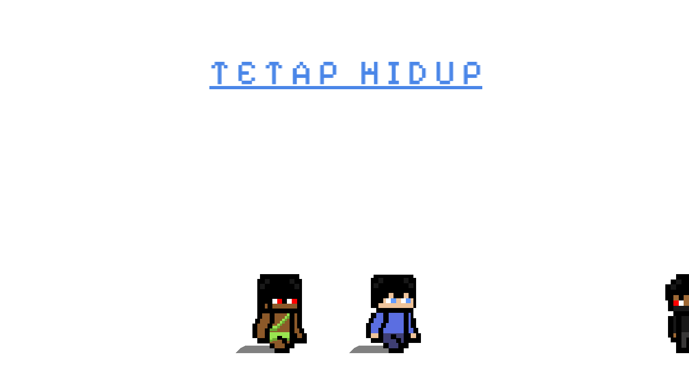
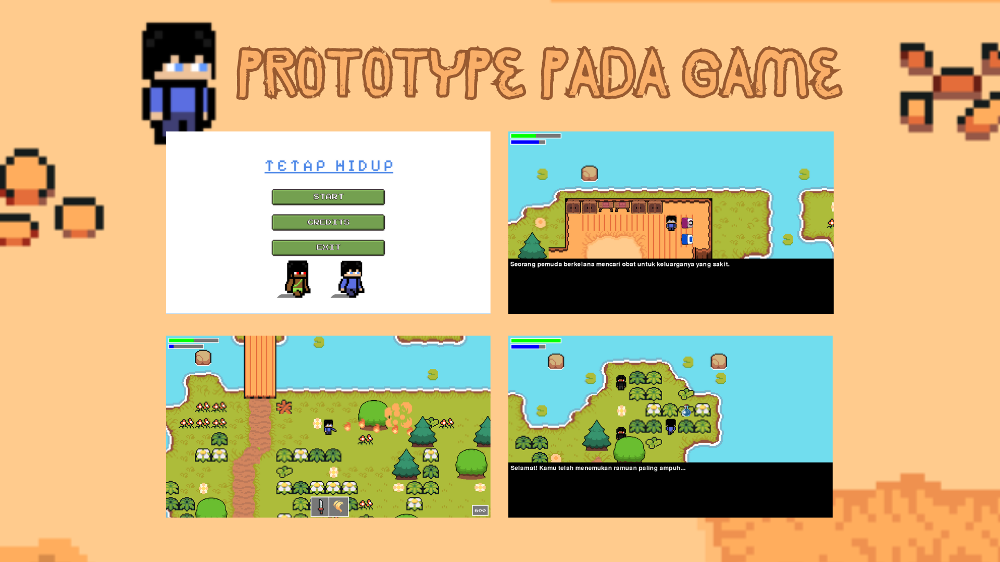
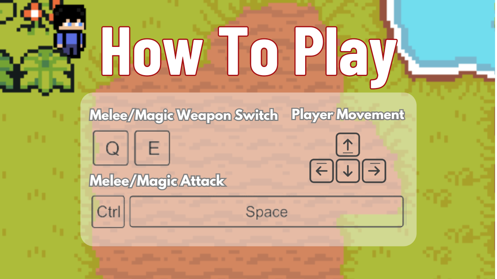
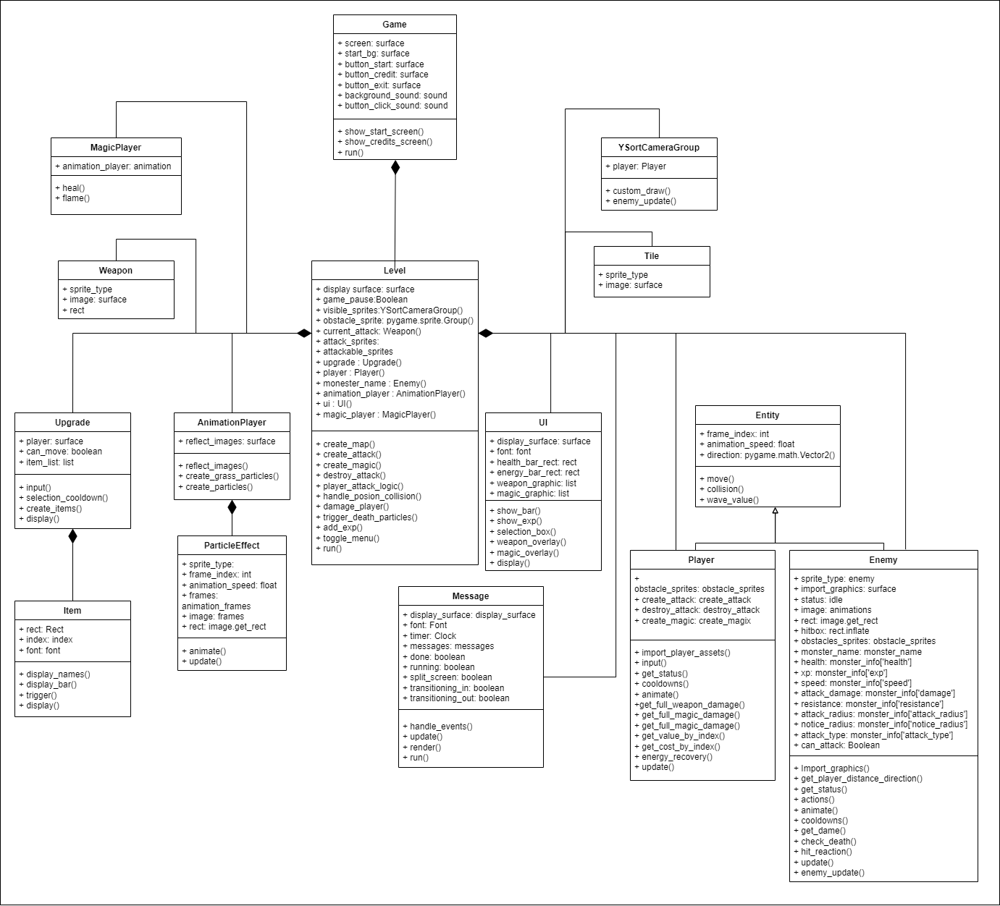

<h1 align="center">Tetap Hidup Advanture</h1>




# Table of Contents
[Description](#description)

[Library](#library)

[How to Play](#howtoplay)

[UML Diagram](#UMLDiagram)

[Contributors](#contributors)

[Thanks To](#thanks-to)

## Description
**Tetap Hidup Adventure Game** is an adventure game with the goal of finding a miraculous potion that can cure the illness of the main character's family. The concept of this game is inspired by the film Black Mirror, where the player becomes an integral part of determining the course of the story. In this game, players are given the opportunity to decide the ending of the game.
## Library
- [**pygame**](https://www.python.org/)
- [**random**](https://docs.python.org/3/library/random.html)
- [**math**](https://docs.python.org/3/library/math.html)

## How to Play


<li> Install Python 3.11 or higher</li>
Run the following command to start the game:

```
python3 main.py
```
alternative command:

```
python main.py
```
## UML Diagram



## Contributors

| Nama | NIM | Contributor |
| ---- | --- | --- |
| M. Arief Rahman Hakim | 122140083 | Lead Programmer, Map Designer |
| Muhammad Ghiffari Iskandar | 122140189 | Lead Designer, Programmer |
| Mulfi Hazwi Artaf | 122140186 | Programmper, Designer |
| Muhammad Kaisar Teddy | 122140058 | Programmer, Map Designer |
| Zidan Raihan | 121140100 | Programmer, Map Designer | 
| Zefanya Danovanta Tarigan | 122140101 | Programmer, Map Designer |


## Thanks To
- [Freepik](freepik.com )
- [Freesound](freesound.org)
- [Clear Code](https://www.youtube.com/@ClearCode)
- [Coding With Rush](https://www.youtube.com/@CodingWithRuss)


